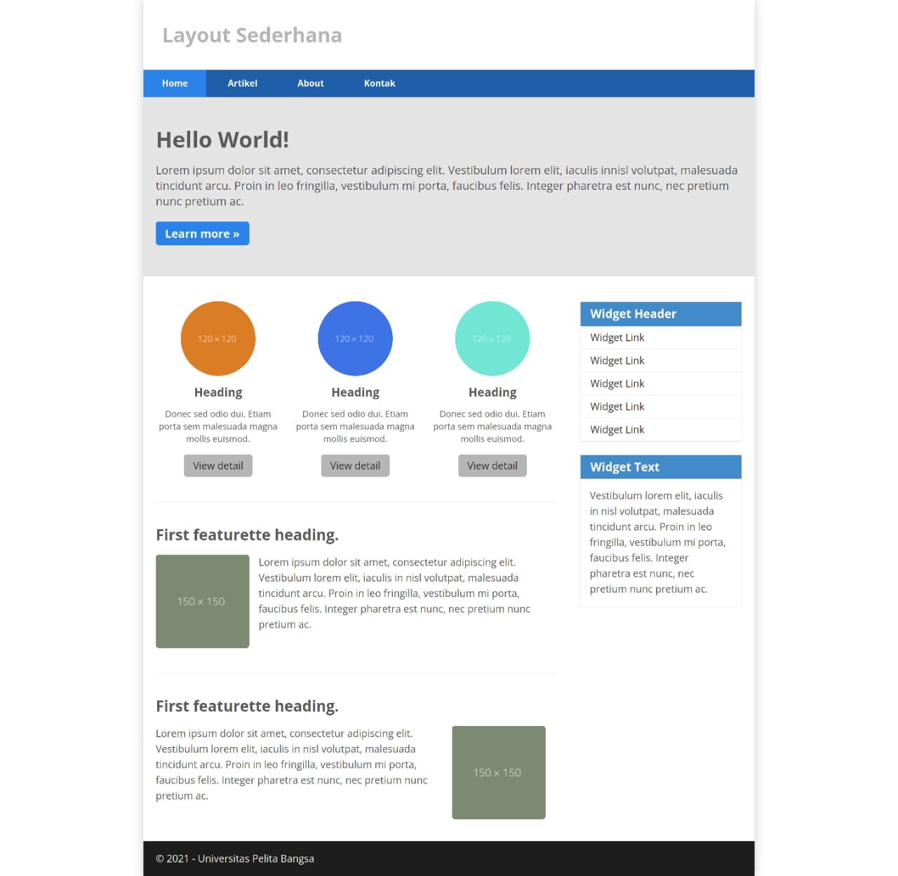

# Tugas Pemrograman Web 2 (Membuat Layout Web Sederhana)
## Profil
- Nama        : Muhammad Alwi Nur Fathihah
- NIM         : 312110388
- Kelas       : TI.21.A.1
- Mata Kuliah : Pemrograman Web 2
### Membuat layout sederhana menggunakan HTML dan CSS

## TERIMA KASIH